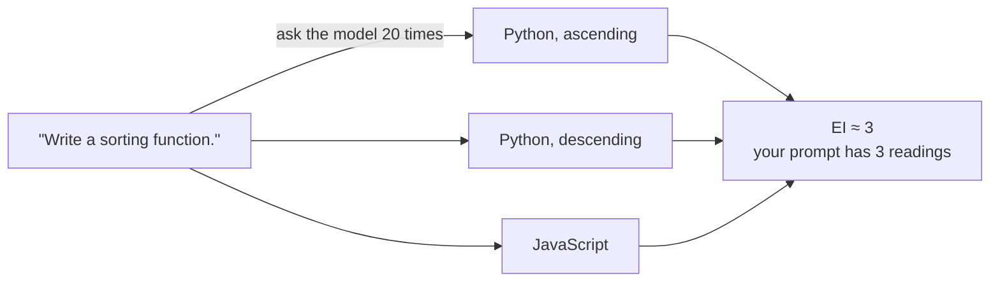

# guessbench — Guesswork Benchmark v0

**A benchmark for your prompts, not your model.** guessbench measures how much interpretive guesswork a text artifact — a prompt, a spec, a task description — forces on a model, and reports it as a single number: **Effective Interpretations (EI)**. EI = 1.0 means the artifact pins down one reading. EI = 4.2 means the model is effectively coin-flipping among ~4 distinct readings, and every downstream token is built on that guess.



## The idea

An artifact induces a distribution over interpretations in a model. A fully specified artifact collapses that distribution to a point; a vague one leaves it wide. You can't observe the distribution directly, but you can estimate its entropy:

```
sample the model N times  →  cluster outputs by meaning  →  H = −Σ pᵢ ln pᵢ  →  EI = e^H
```

If you know [semantic entropy](https://www.nature.com/articles/s41586-024-07421-0) (Farquhar et al., used to detect hallucinations), this is the same machinery pointed in the opposite direction. Semantic entropy holds the input fixed and treats output-meaning entropy as a property of the *model* — its uncertainty. guessbench treats it as a property of the *input*: how much unresolved decision-making the text silently delegates. Same estimator, different attribution — and it turns "this prompt is vague" from a vibe into a measurement.

Why "effective interpretations" instead of raw nats: `EI = e^H` is the entropy's perplexity, so it reads as a count. "This spec has 4.2 effective readings" is legible in a way "1.44 nats" is not.

### A concrete example

Take one task at two specification levels:

| Artifact | What forks | Expected EI |
|----------|-----------|-------------|
| "Write a sorting function." | language × direction × interface × presentation | high |
| "Write a Python function `sort_desc(nums)` that returns a new list sorted in descending order, without modifying the input. …" | one sample uses `sorted()`, another a hand-rolled loop — the author pinned *behavior*, not *algorithm*, so those cluster together | ≈ 1 |

That's the equivalence rule doing the real work: two outputs are the same interpretation iff the author would consider them interchangeable — differing only in ways the request left open to chance. Ascending vs. descending sort is a real fork (counts); `sorted()` vs. a loop under a behavioral spec is not (doesn't count). Wording never counts.

### Why you might care

- **Specs for agents.** Every unresolved dimension in a spec is a decision your coding agent makes for you, silently. EI is a linter for that, run before you burn tokens on the wrong interpretation.
- **The number is audited, not vibes.** The hard part isn't the entropy formula, it's making the clustering track *meaning* rather than temperature noise or phrasing. So the repo ships an acceptance suite that any equivalence strategy must pass before its numbers count (see below) — including a human-agreement gate on the judge itself.

## Quickstart

Requires Python 3.11+ and a running [Ollama](https://ollama.com) server (default setup; an Anthropic API key works via `--provider anthropic`).

```bash
# Models used by the default config
ollama pull llama3.1:8b        # reference model (sampled)
ollama pull qwen3:8b           # judge model (equivalence decisions)
ollama pull nomic-embed-text   # embedding model (Strategy B)

python3 -m venv .venv && .venv/bin/pip install -e ".[dev]"

# Score one artifact — any self-contained text file (plain text, markdown, HTML);
# the contents are sent to the model verbatim. v0 scope: instruction-style
# artifacts up to ~2,000 tokens, no tools or external files.
echo "Write a sorting function." > /tmp/artifact.txt
.venv/bin/guessbench score /tmp/artifact.txt

# Run the calibration/acceptance suite (anchors + 5 ladders x both strategies)
.venv/bin/guessbench calibrate

# Export T5 judge-audit pairs for human labeling, then compute agreement
.venv/bin/guessbench judge-audit
.venv/bin/guessbench judge-audit --labeled-file runs/t5_labeling_sheet.json --answer-key runs/t5_answer_key.json
```

## Interpreting scores

- **EI = 1.0** — every sample is the same interpretation; the prompt fully pins its meaning.
- **EI = 4.2** — the prompt effectively has ~4 distinct readings; the model is guessing among them.
- **EI = N** (the sample count) — every sample read the prompt differently.

Each report includes a 90% bootstrap confidence interval, the cluster table with one exemplar per cluster, and the dimensions along which the judge saw differences (e.g. "programming language", "tone").

### Model-relativity (read this before comparing numbers)

EI is **not a property of the text alone** — it is a property of *(text, model, temperature)*. Every score is stamped `EI@{model, T, N, strategy}` and never emitted bare. Comparing scores across different stamps is meaningless: a prompt can be unambiguous to one model and a coin-flip to another.

### Known v0 caveats

- **Bootstrap CI covers sampling noise only, not judge noise.** A flaky judge narrows nothing; the CI will look confident anyway. Judge quality is checked separately via the T5 human-agreement audit.
- **Small-N entropy bias.** With N = 20, entropy is biased low when the true number of interpretations is large. The CI is reported; no silent correction is applied.
- **Refusals.** Samples that decline or ask clarifying questions cluster like any other sample, but the refusal fraction is reported and artifacts with > 20% refusals are marked `LOW_CONFIDENCE`.
- **Under-diverse sampling.** If T = 1.0 yields suspiciously low diversity on the maximally-open anchor (A4), that is a config problem surfaced by T1, not a finding.

## Equivalence strategies

Two implementations behind one interface; the acceptance suite (`calibrate`) decides which ships as default:

- **`llm_judge` (Strategy A)** — pairwise LLM judge, greedy clustering against cluster representatives, seeded A/B order randomization, per-pair independent calls.
- **`embedding` (Strategy B)** — embeddings + agglomerative clustering; the distance threshold is *selected by the acceptance sweep*, not hand-picked.

Strategy C (NLI bidirectional entailment) was not implemented — see `DECISIONS.md`.

## Acceptance suite (definition of done)

A pipeline like this will happily emit confident-looking numbers whether or not they track ambiguity — the failure mode is measuring lexical diversity or temperature noise instead. So the definition of done is behavioral: fixed anchors with known answers, ladders of the same task at five specification levels that must score monotonically, stability under reruns, and a human audit of the judge's equivalence calls.

| ID | Test | Pass criterion |
|----|------|----------------|
| T1 | Anchors | A1 (exact string), A2 (paraphrase-invariant), A3 (two-way fork), A4 (maximally open) all hold |
| T2 | Monotonicity | Per ladder: Spearman rho(level, EI) <= -0.9 and EI(L5) <= 1.5 |
| T3 | Stability | Disjoint-seed reruns: CIs overlap and delta-EI <= max(0.5, 15%) |
| T4 | Surface invariance | EI(A2) <= 1.3 |
| T5 | Judge agreement | Cohen's kappa >= 0.7 vs ~30 human-labeled pairs (human-gated) |

**Status: the live acceptance run has not been executed yet.** The pipeline is built and unit-tested offline (79 tests, including an end-to-end calibration against a simulated model). Two human gates are open:

1. **Ladder review** — the 5 ladders in `data/ladders/` are `PENDING_REVIEW`; T2 results do not count until the content is approved.
2. **T5 labels** — `judge-audit` produces a blind labeling sheet (~30 pairs, randomized, no strategy verdicts visible).

## Cost notes

With the default local Ollama setup, runs cost nothing but compute time. Every model call (samples, judgments, embeddings) is content-addressed cached in `cache/`; repeat runs are near-instant. `--no-cache` bypasses the cache explicitly. With `--provider anthropic`, a first full calibration run is roughly $10–50 depending on models; cached reruns are near-free.

## Development

```bash
.venv/bin/python -m pytest tests/ -q   # 79 offline tests, no network needed
.venv/bin/ruff check .
```
